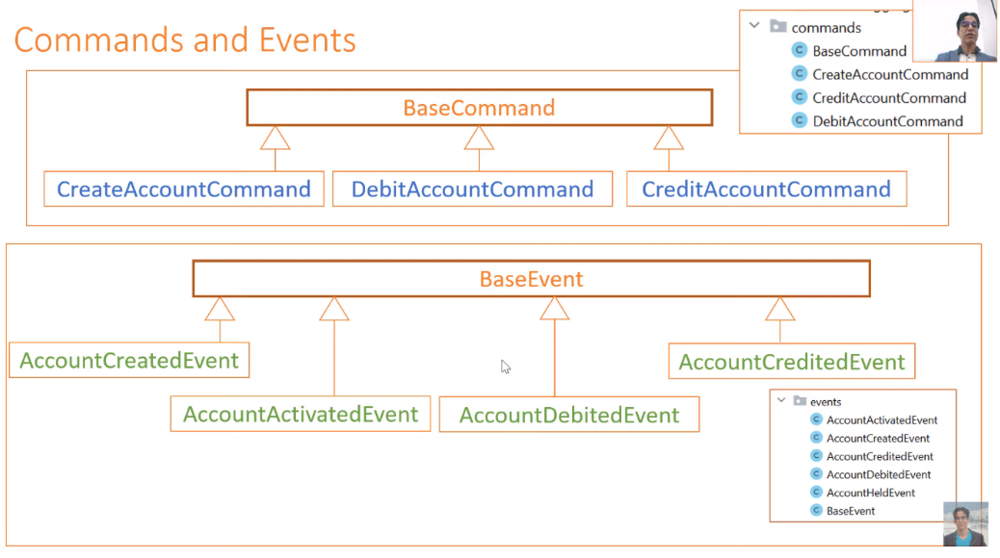
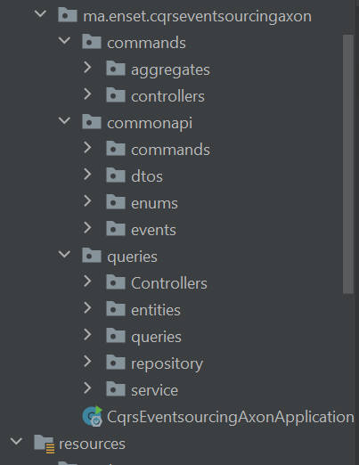
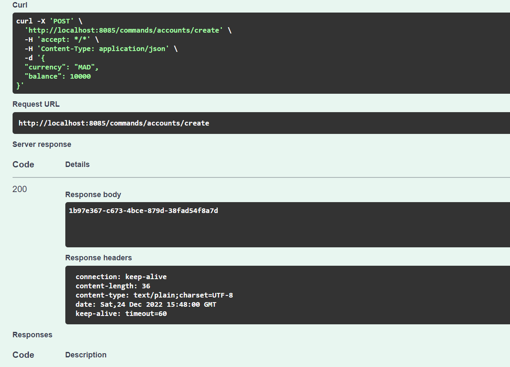
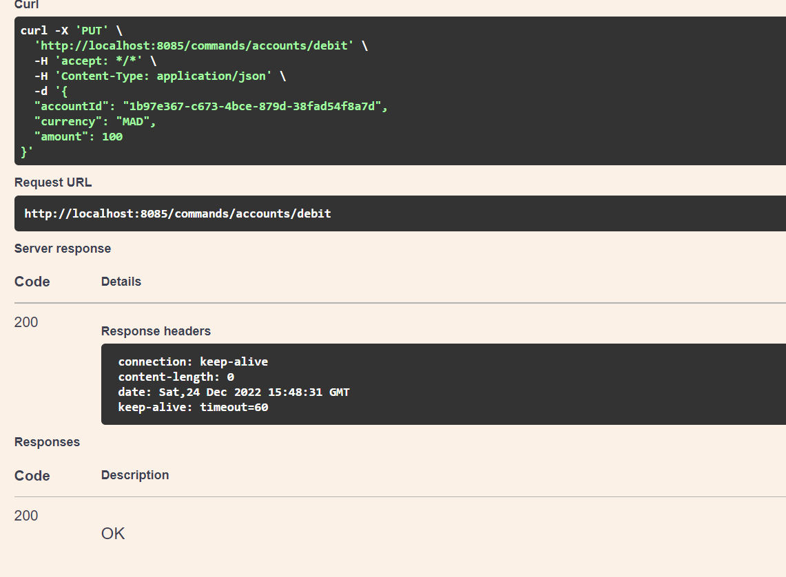
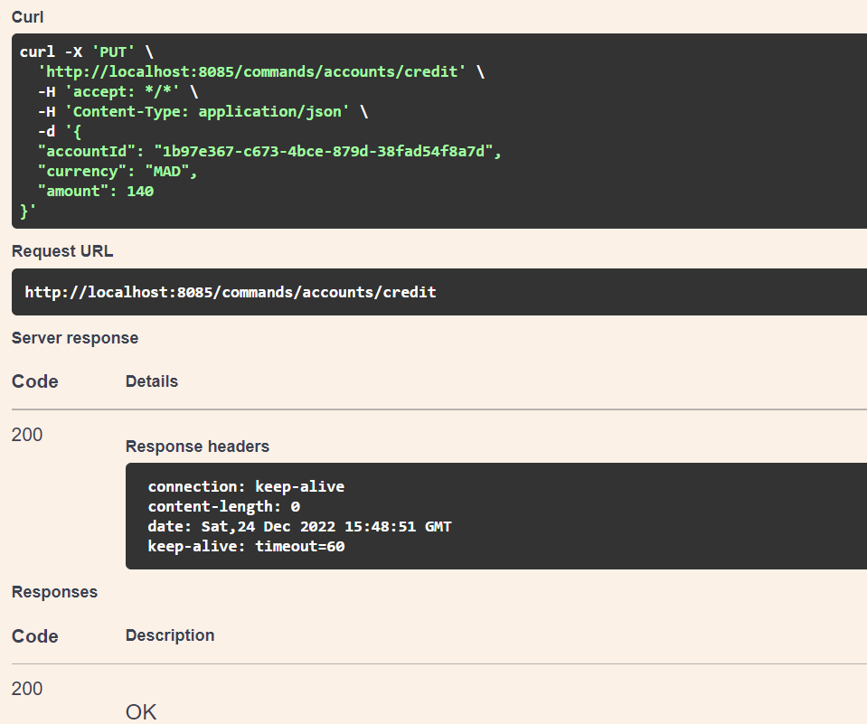
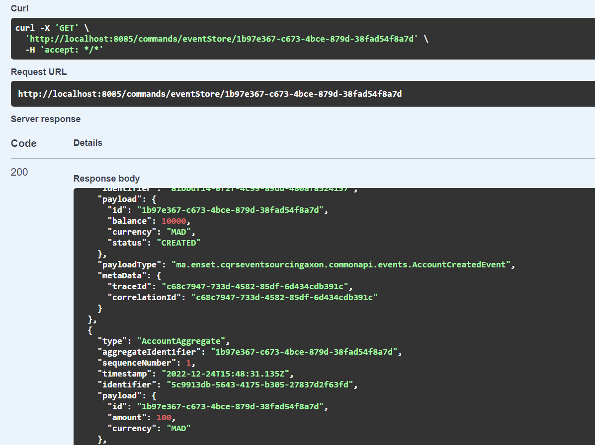
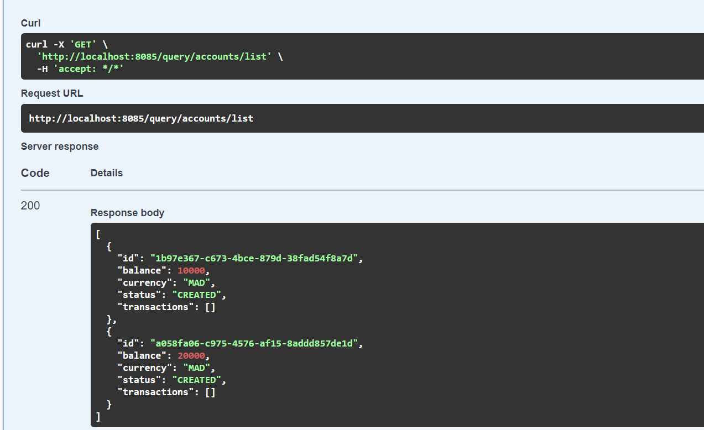

# Creating the Commands & Events

# Project structure

# Testing commands
## Create account command

## debit account command 

## credit account command 

## getting events from event store

# get All accounts query 

